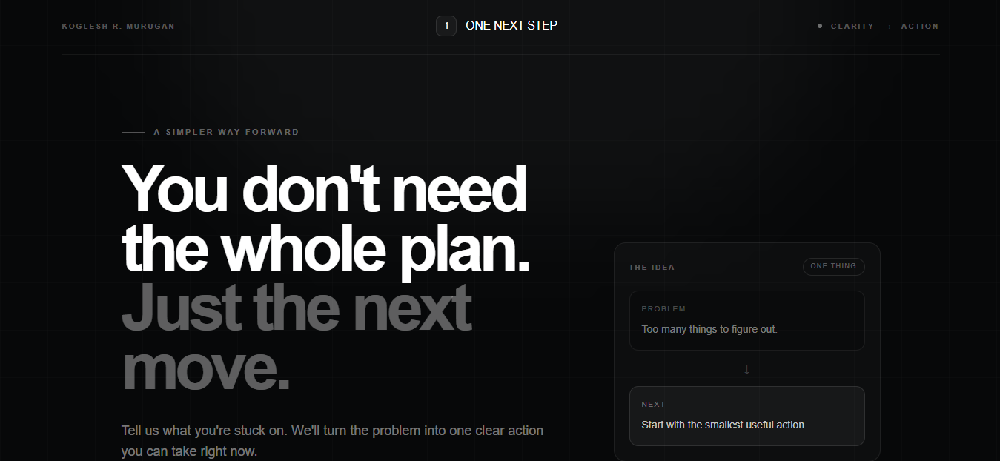

# One Next Step

> **You don't need the whole plan. You need the next move.**



One Next Step is a focused AI decision tool designed for moments when you're stuck, overwhelmed, confused, or unsure where to begin.

Instead of generating a huge plan, it identifies **one concrete action** you can take right now.

Complete that action, come back, and One Next Step determines what should come next.

## Why One Next Step?

Most AI assistants can give you dozens of ideas.

That's not always useful.

When you're already overwhelmed, more information can create more friction.

One Next Step follows a different philosophy:

**Problem → One Action → Progress → Next Action**

The goal is simple:

> Leave the user knowing exactly what to do next.

## Features

* **One-action AI guidance** — generates a single practical next step instead of a long plan.
* **Context-aware progression** — recommendations can build on the user's previous progress.
* **Concise reasoning** — explains why the action comes first.
* **Time estimate** — provides an estimated amount of time for the action.
* **Focus protection** — identifies what to ignore for now.
* **Input validation** — protects the API from malformed and oversized requests.
* **Rate limiting** — helps prevent excessive repeated requests.
* **Structured AI responses** — validates generated responses before returning them to the interface.
* **Copy action** — makes it easy to copy the recommended next step.
* **No account required** — designed for immediate use.
* **Responsive interface** — works across desktop and smaller screens.
* **Minimal interface** — avoids unnecessary dashboards, menus, and distractions.

## The Core Experience

A user starts with something like:

> "I have an idea for an app but I don't know where to start."

Instead of receiving a 20-step roadmap, One Next Step identifies one immediate action.

The user completes it.

Then the application uses the original situation and previous progress to determine the next meaningful move.

This creates a focused progression without overwhelming the user.

## AI Architecture

The application separates the AI logic from the user interface.

```text
User
  │
  ▼
Next.js Interface
  │
  ▼
/api/next-step
  │
  ├── Input validation
  ├── Rate limiting
  └── Request handling
          │
          ▼
      AI Provider
          │
          ▼
        Ollama
          │
          ▼
     Local AI Model
          │
          ▼
   Structured Response
          │
          ▼
     Schema Validation
          │
          ▼
    One Next Step UI
```

The AI is instructed to prioritize:

1. The user's actual situation
2. The smallest meaningful action
3. Immediate usability
4. Logical progression
5. Avoiding unnecessary complexity

## Tech Stack

* **Next.js 16**
* **React**
* **TypeScript**
* **Tailwind CSS**
* **Ollama**
* **Llama 3.2 3B**
* **Zod** for structured response validation
* **Vercel** for web deployment
* **GitHub** for source control

## Project Structure

```text
one-next-step/
│
├── app/
│   ├── api/
│   │   └── next-step/
│   │       └── route.ts
│   │
│   ├── icon.png
│   ├── layout.tsx
│   ├── page.tsx
│   ├── robots.ts
│   └── sitemap.ts
│
├── lib/
│   ├── ai.ts
│   └── prompts.ts
│
├── providers/
│   └── ai-provider.ts
│
├── public/
│
├── .env.local
├── package.json
└── README.md
```

## Running Locally

Install dependencies:

```bash
npm install
```

Make sure Ollama is installed and running.

Check that Ollama is available:

```bash
ollama --version
```

Check the installed models:

```bash
ollama list
```

The current local AI model is:

```text
llama3.2:3b
```

If the model has not been downloaded yet:

```bash
ollama pull llama3.2:3b
```

Start the Ollama model:

```bash
ollama run llama3.2:3b
```

Then, in the project directory, start the Next.js development server:

```bash
npm run dev
```

Open:

```text
http://localhost:3000
```

If port 3000 is already being used, Next.js may automatically use another available port such as:

```text
http://localhost:3001
```

## Environment Variables

One Next Step does not require a Hugging Face token for its local AI engine.

If the application uses additional external services, configure their required environment variables in `.env.local`.

**Never commit `.env.local` or private API keys to GitHub.**

## Development Checks

Before committing changes, run the TypeScript check:

```bash
.\node_modules\.bin\tsc.cmd --noEmit
```

A clean project should complete this command without TypeScript errors.

You can also create a production build:

```bash
npm run build
```

Then run:

```bash
npm run start
```

## Production

One Next Step is designed as a web application and its source code is maintained in GitHub.

**Live application:**

https://one-next-step.vercel.app

> **Important:** the current AI engine uses Ollama running locally. A Vercel deployment cannot directly access an Ollama instance running on your personal Windows computer. Production AI therefore requires a separately hosted AI endpoint or another production-compatible provider.

## Design Philosophy

The interface deliberately uses a minimal visual language.

The product should feel:

* Calm
* Focused
* Premium
* Direct
* Uncluttered

The design reinforces the product philosophy:

**Less information. More direction.**

## Security & Reliability

The API includes protections such as:

* Request validation
* Maximum input lengths
* Rate limiting
* Structured AI output validation
* JSON parsing safeguards
* Server-side environment variable protection

AI-generated responses are validated before being returned to the client.

## Author

**Koglesh R. Murugan**

One Next Step is an independent project exploring how AI can help people move from uncertainty to action without overwhelming them with information.

## Status

**Active Development**

The core experience is intentionally focused:

> **One problem. One action. One next step.**
